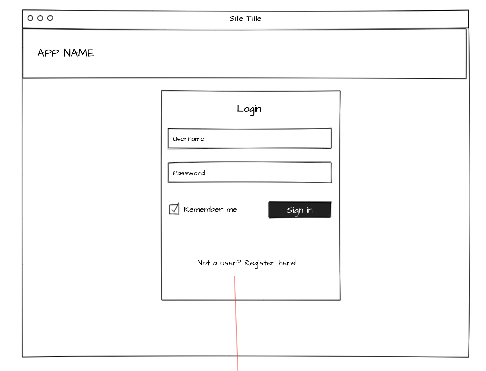
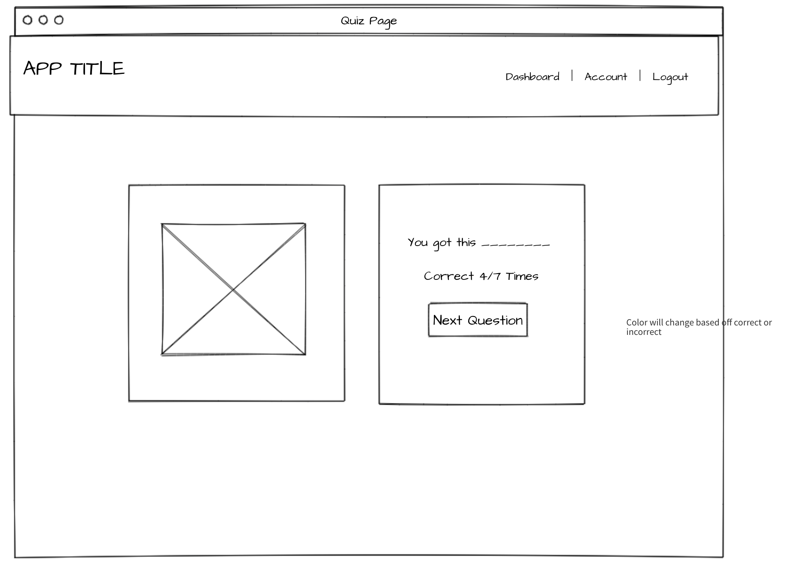

## Table of Contents

- [Description of App](#description)
- [Features](#features)
- [Link to deplyed version](#deployed-version)
- [Server and Client](#server-and-client)
- [Tech Stack](#tech-stack)
- [Data Models](#data-models)
- [API Endpoints](#api-endpoints)
- [Future Plans](#future-plans)


## Description

Welcome to uh-SIGN-ment! A learning app designed to teach you the
basics of American Sign Language! We've built this application with
the best learning techniques in mind to help you retain as much
information as possible! With each <strong>uh-SIGN-ment</strong>,
you'll reinforce your knowledge of <strong>ASL</strong>, and be able
to see your progress!

## Deployed Version

You can fine a live version:
[Live Version](https://sign-app-client.herokuapp.com/dashboard)

## Features 
Users can login and start learning sign language. Users are presented with a dashboard that will keep track of their records and stats with every word and able to make sure they are focusing on the words/letters then need to be.

Users are given feedback and they are learning using a spaced repetition algorithm. 

## Screenshots
`Screenshots`





`Live App`


## Server and Client

Here is a link to our [Client-side](https://github.com/thinkful-ei22/asl-client-richard-akim)

Here is a link to our [Server-side](https://github.com/thinkful-ei22/asl-server-richard-akim)
[](https://travis-ci.org/thinkful-ei22/asl-server-richard-akim)


## Tech Stack

Frontend: Created with create-react-app, styling done with CSS. Html. React-redux to keep a store of the state. Thunk middleware for async actions. Redux forms for form inputs.

Backend: Node.js and Express. Passport and JWTs

Database: MongoDB

## Data Models
### User Schema
```
{
  username: {
    type: String,
    required: true,
    unique: true
  },
  password: {
    type: String,
    required: true
  },
  name: { type: String, default: "" },
  questions: [
    {
      questionId: { type: mongoose.Schema.Types.ObjectId, ref: "Question" },
      imageURL: String,
      imageDescription: String,
      answer: String,
      memoryStrength: { type: Number, default: 1 },
      next: Number,
      correct: { type: Number, default: 0 },
      incorrect: { type: Number, default: 0 }
    }
  ],
  head: { type: Number, default: 0 },
  totalCorrect: { type:Number, default: 0}, 
  totalWrong : { type:Number, default:0 },
  needImprove : [{
    imageURL: String,
    imageDescription: String,
    answer: String,
    correct: { type: Number, default: 0 },
    incorrect: { type: Number, default: 0 }
  }]
});

UserSchema.set("toObject", {
  virtuals: true, // include built-in virtual `id`
  versionKey: false, // remove `__v` version key
  transform: (doc, ret) => {
    delete ret._id; // delete `_id`
    delete ret.password;
  }
}
```
### Question Schema
```
{
  imageURL: String,
  imageDescription: String,
  answer: String
}
```
## API Endpoints
All requests and responses are in JSON
### Users
`POST` request
```
{
  username,
  password,
  name,
}
```
Returns 
```
{
  username,
  name
}
```
`GET` request to `/progress`
```
{
  totalCorrect,
  totalWrong,
  needImprove
}
```
### Authentication
`POST` request to `/login`
```
{
  username,
  password
}
```
Returns
```
{
  authToken
}
```
`POST` request to `/refresh` submits a token for a new token
```
{
  authToken
}
```
Returns
```
{
  authToken
}
```
### Questions
`GET` request
```
{
  imageURL,
  imageDescription,
  answer
}
```
`PUT` request to `/reset` to reset User's question array
`POST` request 
```
{
  correct(bool)
}
```
Return 
```
{
  imageURL,
  imageDescription,
  answer
}
```


## Future Plans

We would like to add a seperation between types of questions where you can pick the genre of whatever you are learning be it the alphabet or even commonly used everyday signs.